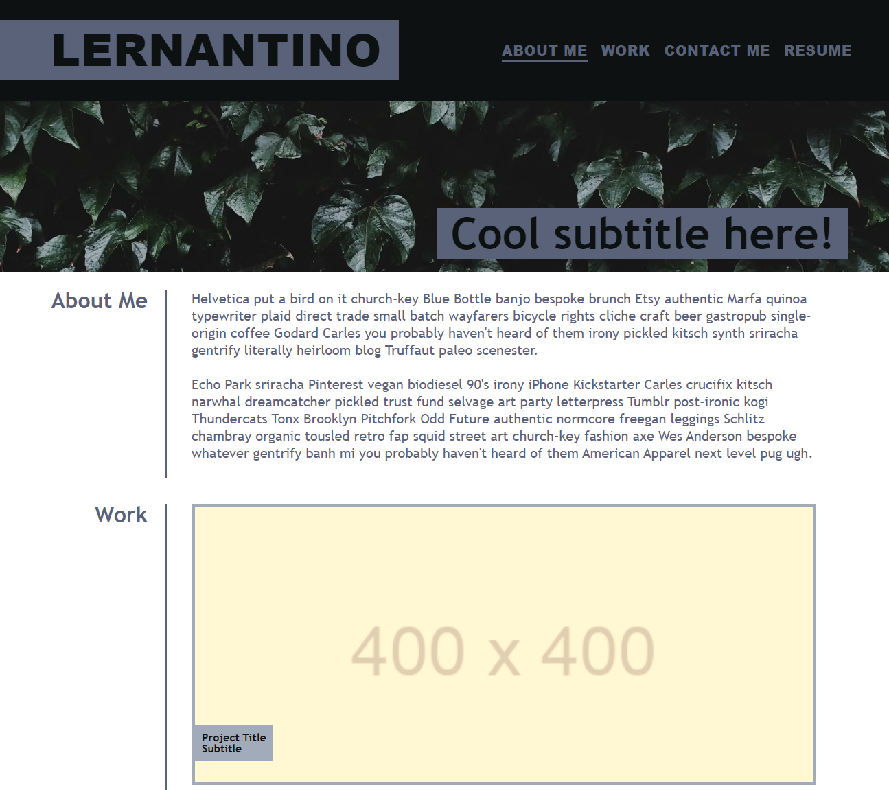
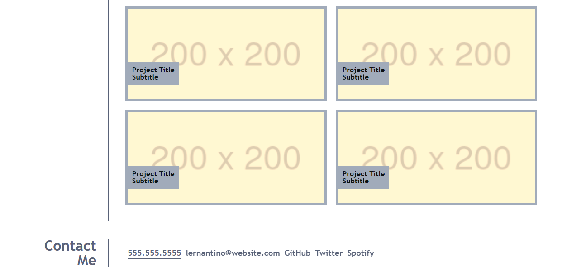

# <personal-portfolio>

## Description

This portfolio template project serves as a comprehensive showcase of about-info, work, and contact-info. The portfolio is structured to be clearly visible and easy to navigate. Navigation is allowed through the nav elements that direct the viewer to respective secctions of the portfolio. The main motivation behind creating this template is to give myself, and people looking for a portffolio template a good starting point. This template also showcases the ability to follow a template and implement the design from scratch.

## Learning Outcomes

- The importance of responsive design and how to implement it using media queries.
- How to use CSS variables for consistent theming.
- Techniques for enhancing user experience, such as hover effects and animations.

## Mock-Up

```md

```
```md

```

## License

This project is licensed under the MIT License.

## Features

### Navigation
- A fixed navigation bar that includes links to sections of the website 
- Scrolling to different sections of the page when navigation links are clicked

### About Me Section
- Dedicated section to introduce myself

### Work Section
- Showcase template of projects displayed in a grid format
- Each project includes an image, title, and subtitle, with hover effects to enhance interactivity

### Contact Me Section
- Contact information with links to phone number, email, GitHub, Twitter, and Spotify profiles
- Links are styled with hover effects to indicate interactivity

### Responsive Design
- The portfolio is designed to be fully responsive, with layout adjustments for mobile, tablet, and desktop devices
- Flexbox and CSS Grid are utilized to ensure the layout adapts smoothly across different screen sizes